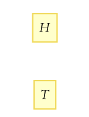
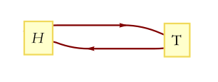
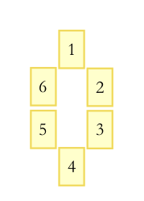
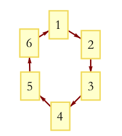
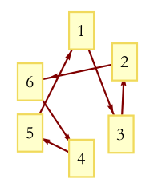
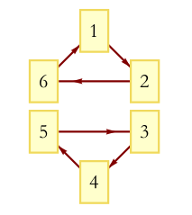
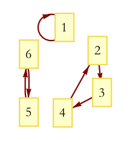
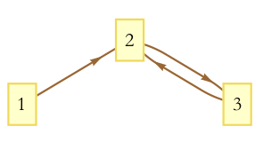
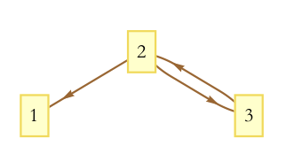
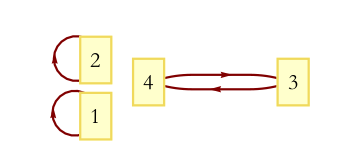

<h2>Table of Contents</h2>

<ul>
<li><a href="#sec-1">1. 经典物理的本质</a>
<ul>
<li><a href="#sec-1-1">1.1. 什么是经典物理?</a></li>
<li><a href="#sec-1-2">1.2. 简单动力系统和相空间</a></li>
<li><a href="#sec-1-3">1.3. 不被允许的规律:负一定律</a></li>
<li><a href="#sec-1-4">1.4. 无穷个状态的动力系统</a></li>
<li><a href="#sec-1-5">1.5. 循环和守恒律</a></li>
<li><a href="#sec-1-6">1.6. 精度的极限</a></li>
</ul>
</li>
</ul>

# 经典物理的本质

> 在Steinbeck country的某个地方,两位退休的老人坐在路边.Lenny用他手指梳着头发说,"给我讲讲物理学的法则吧,George".George低头沉思片刻,然后透过眼镜片的顶部看着Lenny说,"OK,Lenny,但只是最核心的.  

## 什么是经典物理?

经典物理这个术语的含义指在量子力学之前的所有物理.经典物理包括物体运动的牛顿定律,麦克斯韦和法拉第的电磁场理论以及爱因斯坦的广义相对论.但它不仅只是针对特定物理现象的一些理论;它是一系列原理和法则的集合,是一种逻辑,这种逻辑支配着现实世界中那些量子不确定性无足轻重的那部分现象.这些通用的法则称为经典物理.

经典物理的任务是对未来的预测.十八世纪伟大的物理学家拉普拉斯将其表述如下:

> 我们可以把目前宇宙的状态看作是它过去的结果以及它未来的起因.如果有一个智者,他知道某一时刻施加于运动上所有的力和所有物体的位置.而且这个智者有无穷的力量将这些数据分析.那么他最终将得到一个能统摄宇宙极大之物和极小原子的运动公式.对于这个智者来说,未来的一切都是确定的,就如同过去的历史一样,被清晰的展现在眼前.      

在经典物理中,如果你知道了系统某一时刻的所有信息,并且知道了描述该系统运动的方程,那么你就能预测这个系统的未来.这就是所谓的经典物理的法则-确定性.如果我们知道所有同样的信息,但将过去和未来反转一下,然后根据同样的方程,你能够获得关于过去的全部信息.这样的一个系统又是可逆的.

## 简单动力系统和相空间

我们把一系列物体的集合,无论物体是粒子,场,波还是其他任何东西,都可以叫做一个系统.一个系统要么是整个宇宙,要么是与其余任何物体孤立并不受其影响的孤立系统.

为了进一步理解系统决定性和可逆性的含义,我们将以一些极其简化的孤立系统的例子作为开始.这些例子比我们在物理学中经常研究系统的要简单,但却满足经典物理中最重要的法则的要求.想象一个只有一种状态的抽象物体.我们可以认为它是一个被粘在桌面上的一个硬币,永远只有一面朝上.在物理学中,把一个系统所有状态的集合称为相空间(State-space).相空间并不是我们平常意义上的空间,它是一个数学集合,其中的每一个元素都表征系统某一个可能出现状态.在这个例子中,相空间的状态只有一个,我们称其为Heads(意思是头朝上),简记H.由于系统只有一个状态,预测其未来变得非常简单-系统状态没有变化进而观测到任意时刻的输出总是H.

下一个例子中的系统的相空间有两个点组成,此时系统有一个抽象的物体和两个可能状态.还以硬币为例,此时硬币要么正面(记作H),或者背面(记作T).如图1.

在经典力学中,我们假设系统随时间光滑的演化,其中没有间断和跳跃.我们称这种方式是连续的.显然,在这个例子中,系统的运行不是连续的,而是离散的.此时假设系统的离散的时间步以整数表示.

随着时间变化的系统称为动力系统.除了包含相空间之外,一个动力系统必须包括动力法则,或者称其为运动规则.动力法则会根据该时刻的状态告诉我们下一时刻的状态.

一个非常简单的动力规则是无论此时刻的是什么状态,下一时刻仍然保持该状态.在这个例子中,物体的轨迹只有两种可能:HHHHHH&#x2026;和TTTT&#x2026;.

另一个动力规则是无论此时状态如何,下一时刻的状态永远是该时状态的对立状态.我们可以通过示意图来表示这两种规则.图2表示第一个法则,其中箭头从H到H或者从T到T.可以看出,非常容易预测未来:如果从H开始,则系统会始终保持H状态;如果从T开始,则系统将停留在T状态.

figure3是第二个规则的示意图,其中箭头从H到T,或者从T到H.此时,你仍可以预测系统的未来.比如,如果从H开始,则系统以后的状态将是H T H T H T &#x2026;.如果从T开始,则是T H T H T H &#x2026;.

我们甚至可以将动力规则写成方程的形式.用来描述系统的变量的个数称为系统的自由度(degrees of freedom).此时的系统只有一个自由度,我们可以使用一个希腊字母 \(\sigma\) 表示. \(\sigma\) 只有两种可能的值: \(\sigma = 1\)  或者 \(\sigma = -1\) ,相应地,分别表示H和T.同时,需要一个符号来记录时间.当系统随时间连续变化时,我们以t表示.此处,我们的系统是离散的,用n来代替.系统在n时刻的状态以 \(\sigma(n)\) 表示,意思是n时刻的状态为 \(\sigma\).

下面将写出这两种规则的演化方程.第一个规则表示系统没有任何改变,以方程的形式如下,

$$\sigma(n+1) = \sigma(n).$$

换句话说,不该第n步的值是什么,第n+1步的值仍会是相同的值.

第二个规则有如下形式,

$$\sigma(n+1)=\sigma(n).$$

意味着下一时刻状态将会反转.

在这些例子中,未来的状态完全是由初始的状态决定的.因此,这些规则是确定性的.经典力学中的基本定律都是确定性的.

为了使事情变的更加有趣,我们通过增加状态的个数来拓展我们的系统.这里,我们使用一个六个面的骰子来代替之前的硬币,此时系统中有六个可能的状态(如图4).

此时,我们有许许多多可能的规则,这些规则可能很难使用语言甚至方程描述.最简单的方法就是将其用像图5一样的示意图来表示.图5给出了n时刻骰子的状态数值,在下一个时刻n+1,状态的值也会增加一个单位.系统一这种方式运行直达到达状态6,在次状态下,示意图告诉我们,下一状态将回到1,并且不断重复该模式.这种没有结束的模式被称为循环(cycle).例如,我们从3开始,则未来的状态是3,4,5,6,1,2,3,4,5,6,1,2&#x2026;.将这种模式为动力规则一.

图6中是另外的一个规则-动力规则二.它看起来比第一个要混乱.但是,事实上两者在逻辑上确是等价的,既每个循环都会遍历系统的所有六个状态.如果重新标记状态,则法则二会变成法则一.

并不是所有的规则在逻辑上都是等价的.考虑图7中的规则,并称其为规则三.法则三有两个循环.如果你在其中一个,那么就不可能跳到另外一个.但同时,这个规则是完全确定性的.不管你从那里出发,系统的未来都是确定的.例如,如果你从2开始,则系统的路径将会是2,6,1,2,6,1,&#x2026;并且永远不会到达状态5.反之,如果从状态5出发的话,系统未来路径是5,3,4,5,3,4,&#x2026;,此时你永远不会到达状态6.

   

一个六个状态的系统,要花许多时间才能写出所有可能的法则.

## 不被允许的规律:负一定律

根据经典物理的定律,并不是所有的规则都是允许的.一个动力系统的动力规则不仅要是确定的;它还需要是可逆的.

物理学中可逆性的概念有几种不同的描述方法.最简洁的描述是,如果你将系统示意图中所有的箭头方向都逆转,那么得到的系统仍然是确定性的.也就是说系统的法则对过去和未来都是确定的.回顾拉普拉斯的名言-"对于这个智者来说,未来的一切都是确定的,就像过去一样,被清晰的展现在眼前."有没有一个规则,对于未来是确定的,但对于过去却不是?换句话说,我们能构造一个不可逆的规则吗?事实上是可以的,考虑图9如下:

图9的规则告诉你,无论你在哪里,你下一步将会到哪里.如果你在1,下一状态将是2.如果你在2,下一步将是3,如果在3,将到达2.对于系统的未来,并没有模糊之处.但对于过去却是另一种情况.假设你处于2的位置,那你上一个状态是什么?你可能从3或者从1来.示意图不会告诉你.更糟糕的是,从可逆性的定义,没有状态能到达1;也就是说状态1没有过去.图9中的系统就是不可逆的.这个例子说明了经典力学中需要避免的情况.

注意到如果你将图9中的箭头变成图10中所示,相应的法则将无法告诉你将来的状态.

有一个非常简单的手段来判断一个示意图是否代表一个确定性的可逆的系统.如果每一个状态都有唯一的箭头指向它,并且有唯一的箭头从其中流向其他状态.那么该系统便是一个确定性的可逆的系统.记住这口号:必须有一个箭头告诉你将去哪里和一个箭头告诉你从哪里来.

动力系统的规则必须是确定性的和可逆的这一定律对经典力学是如此的重要以至于我们有时忘了提及.事实上,它甚至没有一个名字.我们可以把它叫做第一定律,但不幸的是我们已经有了两个第一定律-牛顿第一定律和热力学第一定律.而且,在热力学中甚至已经有了一个第零定律.因此,我们不得不称其为负一定律以体现这所有物理定律中一毫无例外最基本的一个-信息守恒定律.信息守恒的含义是对每一状态,均存在一个进入箭头和一个出去箭头.这保证了你永远不会失去出发的路径.

信息守恒定律并不是一个传统的守恒律.在讨论无穷状态的系统之后我们会重新回到守恒律.

## 无穷个状态的动力系统

目前为止,所有的例子都是状态空间只有有限个状态的情况.但是没有理由我们不能拥有一个无穷多状态的系统.例如,想象一条线,其上有无穷多个离散的点,就像一条两端都有无穷个车站的铁轨.为了描述这个系统,我们对车站进行编号,就像之前对时间做的那样.由于使已经用了n作为时间的标记,我们使用一个大写的N作为状态的标记.所有的这些标记构成一个函数N(n),告诉n时刻的状态是N.图11给出系统的示意图.

对于这种系统,一个非常简单的动力规则如图12所示,每一个时间步,既将标记向正方向移动一个单元.

这种方式是可行的,因为每个状态都有一个箭头进入,一个箭头流出.我们可以容易地将这个法则表述成如下的方程:

$$N(n+1) = N(n) + 1$$

下面是一些其他的可能的法则,但这些法则并不都是被允许.

$$N(n+1)=N(n)-1$$

$$N(n+1)=N(n)+2$$

$$N(n+1)=N(n)^{2}$$

$$N(n+1)=-1^{N(n)}N(n)$$

在第一个法则中,不管你从哪里开始,最终要么到达将来或者到达过去.在该法则中,有一个无穷循环.在第三个法则中,如果你从一个奇数N开始,你将永远不会到达一个偶数值,相反情况同样成立.因此我们说有两个无穷循环.

我们可以增加一些不同的状态来制造更多的循环,正如图图13中所示.

如果,从一个数开始,将沿着第一条线推进.如图12中一样.另一种情况是,如果从A或B开始,将从他们中循环.这样,我们就创造出了一个有限循环和无限循环的例子.

## 循环和守恒律

当相空间被分成不同的循环的时候,系统仍然保持循环开始.每个循环都有其动力规则,但他们都是同一个状态空间的部分,因为它们描述的是同一状态空间.考虑如下有三个循环的系统.每个状态1和状态2都属与它各自的循环,同时状态3和状态4属与第三个(如图14).

当一个动力规则将系统分成几个独立的循环的时候,我们把这个循环的模式称为守恒律.它告诉我们有些事一直保持不变.为了量化这些守恒律,我们给每一个循环以一个数值Q.如图15所示,三个循环分别标记为Q=+1,Q=-1,以及Q=0.并且不管Q的值是什么,它始终保持不变,也就是Q是守恒的.

在以后的章节中,我们将考虑相空间和时间都是连续的例子.所有我们在简单离散系统中讨论的都有其中复杂系统中对应的部分,这些将在以后的章节讨论.

## 精度的极限

拉普拉斯对于世界的可预测性过于乐观,即使是对经典物理.他肯定会同意对未来的预测需要对统治现实世界的动力学定律有完整的了解,同时也需要无穷的计算能力,他称这种能力为"为分析提供大量数据的无穷智能".但是,他仍然低估了另外一个重要的部分-能够获得足够精度的初始条件的能力.想象一个有一百万面的骰子,给每个面都涂上足够接近但却有微小差异的单精度整数.如果一个人已知道骰子的运动规律,并且确定了骰子初始时刻的数字,那他就能够预测未来时刻骰子的状态.但是如果拉普拉斯的"无穷智能"遇到了一点视觉模糊,以至于不能辨别骰子不同面的细微区别,那么他的预测能力将会受到限制.

在现实世界中,情况可能更加糟糕-相空间状态的个数不仅是无穷的,而且是连续的.换句话说,它是由实数集合来标记其状态的.实数是如此的稠密,以至于任何两个实数之间都能找到无穷多个的实数.在实际实验中,我们把将数字从它周围数字中分辨出来的能力叫做"分辨力",并且任何实际观测者的分辨力都是有限的.理论上,我们无法获得无穷精度的初始条件.在大部分情况下,初始条件的极微小差异最终会导致输出结果的巨大差别.这种现象被称为混沌(Chaos).如果一个系统是混沌的(事实上大部分系统都是),那就意味着无论我们的分辨力有多强,该系统能够被预测的时间都是有限的.完全的预测能力是无法获得的,仅仅是因为我们的分辨力是有限的.