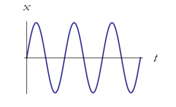
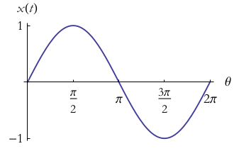
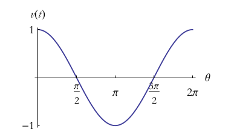

<h2>Table of Contents</h2>

<ul>
<li><a href="#sec-1">1. 运动</a>
<ul>
<li><a href="#sec-1-1">1.1. 数学序曲:微分学</a></li>
<li><a href="#sec-1-2">1.2. 运动</a></li>
<li><a href="#sec-1-3">1.3. 运动的例子</a></li>
</ul>
</li>
</ul>

# 运动

> Lenny抱怨说:"George, 这种阶跃的方式让我感到紧张.我们的时间真是以这种跳跃的方式运行吗? 我希望一切可以更流畅一些."
> 
> George想了一会儿,把黑板擦干净,说道,"好的,Lenny, 今天就让我们来学习那些连续变化的系统."

## 数学序曲:微分学

在本书中,我们主要研究变量是如何随着时间变化的. 经典力学绝大部分的内容都是处理物体随时间光滑变化的情形-既连续变化这一数学术语. 不像我们第一节中那样的随时间离散变化系统,此时系统的动力法则是连续随时间从系统一个状态过渡到另一个状态. 因此,我们将对以时间 \(t\) 为自变量的函数感兴趣.

对于连续的变化,在数学上,我们将使用为微积分这一工具. 微积分是极限的运算,因此有必要首先理解极限这一概念. 假设我们有一个数列,  \(l_{1}\) , \(l_{2}\) , \(l_{3}\) , &#x2026; ,这一数列越来越逼近一个值 \(L\). 例如,数列 0.9, 0.99 ,0.999, 0.9999, &#x2026;. 这个数列的极限是1 . 数列中没有一项为1,但随着 \(n\) 的增长,数列的项越来越接近1. 我们以方式来表示这种趋势

$$\lim_{i\rightarrow \infty}l_{i}=L.$$

既 \(L\) 是 \(l_{i}\) 随着 \(i\) 趋于无穷时的极限.

这一极限思想同样可以应用于函数. 假设我们有一个函数- \(f(t)\) , 我们想描述当 \(t\) 不断趋近某一个值时,函数值的变化情况. 如果当 \(t\) 趋近 \(a\) 时, \(f(t)\) 任意趋近 \(L\), 那我们就说当 \(t\) 趋近于 \(a\) 时 \(f(t)\) 的极限是 \(L\) .记作如下.

$$\lim_{t \rightarrow a}f(t) =L.$$

让 \(f(t)\) 是变量 \(t\) 的函数,既 \(t\) 变化时, \(f(t)\) 相应变化. 微分处理的是这类函数的变化率的问题. 微分的思想是在 \(f(t)\) 的某个时刻,改变微小的时间来观察 \(f(t)\) 是如何相对于 \(t\) 变化. 我们用一希腊字母 \(\delta\) 表示这种变化. 让我们把时间 \(t\) 上的改变记为 \(\delta t\) (这里不是 \(\delta \times t\) ,而是表示 \(t\) 上的微小变化). 在 \(\delta t\) 这一时间段, \(f\) 从 \(f(t)\) 变化到 \(f(t + \delta t)\). \(f\) 的变化,记作 \(\delta f\) , 其含义如下,

$$\delta f = f(t+ \delta t) - f(t)$$

为了精确地定义 \(t\) 时刻的变化率, 我们必须令 \(\delta t\) 趋于0. 当然,当我们将 \(\delta t\) 趋于0的时候, \(\delta f\) 也会趋于0, 但是如果我们令 \(\delta f\) 除以 \(\delta t\), 这个比例将趋于一个极限. 这个极限是 \(f(t)\) 关于 \(t\) 的导数.

$$\frac{d f(t)}{dt}=\lim_{\delta t \rightarrow 0}\frac{\delta f}{\delta t}=\lim_{\delta t \rightarrow 0}\frac{f(t+\delta t) - f(t)}{\delta t}$$

一个严谨的数学家更喜欢将 $$\frac{d f(t)}{d t}$$ 看作是两个微分的比值,但我们这里的处理会保证你不会出现错误.

让我们来计算一些导数. 首先从 \(t\) 的指数函数开始. 特别地, 我们将该方法应用到 \(f(t) = t^{2}\) 这一个函数. 我们将通过定义 \(f(t+\delta t)\)  应用上面的公式:

$$f(t + \delta t) = (t + \delta t)^{2}.$$

我们可以将\((t + \delta t)^{2}\) 因式分解.得到:

$$f(t + \delta t) = t^{2} + 2t \delta t + \delta t^{2}$$

提取出\(f(t)\):

$$f(t + \delta t)-f(t) = t^{2} + 2t \delta t + \delta t^{2} - t^{2}$$
$$=2t\delta t + \delta t^{2}$$

下一步是除以 \(\delta t\):

$$\frac{f(t+\delta t)-f(t)}{\delta t}=\frac{2t \delta t + \delta t^{2}}{\delta t}$$
$$ 2t +\delta t$$

现在,取 \(\delta t \to 0\) 的极限变的容易. 第一项步依赖 \(\delta t\) , 但是第二项会趋于零并消失. 这里需要记住: 高于 \(\delta t\) 的项在计算微分的时候会被忽略. 因此,

$$\lim_{\delta t \to 0}\frac{f(t+\delta t)-f(t)}{\delta t}=2t$$

\(t^{2}\) 的导数是

$$\frac{d(t^{2})}{dt}=2 t$$

现在让我们考虑更一般的幂函数, \(f(t) = t^{n}\). 为了计算它的导数, 我们首先要计算 \(f(t+\delta t) = (t + \delta t)^{2}\). 可以用二项式定理来解决. 给定两个数, \(a\) 和 \(b\), 我们可以计算 \((a + b)^{n}\) . 二项式定理如下:

$$(a + b)^{n} = a^{n} + n a^{n -1} b + \frac{n (n-1)}{2} a^{n-2} b^{2}+ \frac{n(n-1)(n-2)}{3} a^{n-3} b^{3}+...+b^{n}$$

这个表达式有多长? 如果 \(n\) 是整数的话, 最终会有 \(n+1\) 项. 但事实上, \(n\) 可以是任意的实数或复数. 如果 \(n\) 不是一个整数, 这个表达式不会结束,它是一个无穷级数. 幸运地是,对于我们的目的,只有头两项是重要的.

为了计算 \((t+\delta t)^{n}\), 我们所做的是将 \(a=t\) 和 \(b=\delta t\) ,得到,

$$f(t + \delta t) = (t + \delta t)^{n} =t^{n} + nt^{n-1} \delta t + .... $$

所有以 &#x2026; 表示的项在极限中趋于零,因此可将其忽略.

现在提取 \(f(t)\) 或 (\(t^{n}\),

$$\delta f = f(t+\delta t) - f(t) = t^{n} + n t^{n-1} \delta t + \frac{n(n-1)}{2}t^{n-2}\delta t^{2} + ... -t^{n}$$
$$nt^{n-1}\delta t + \frac{n(n-1)}{2}t^{n-2}\delta t^{2} + ....$$

除以 \(\delta t\) ,

$$\frac{\delta f}{\delta t} = n t^{n-1} + \frac{n(n-1)}{2}t^{n-2}\delta t + ....$$

并且使 \(\delta t \rightarrow 0\) . 导数为

$$\frac{d(t^{n}}{dt}=nt^{n-1}$$

重要的一点是,这个关系对于 \(n\) 不是整数仍然成立, \(n\) 可以是任何实数或复数.

这里给出一些该导数的特例: 如果 \(n=0\) , 那么 \(f(t)\) 只是一个数 1. 导数为0-这也是对与任何不会改变函数的情况. 如果 \(n=1\) , 那么 \(f(t) = t\)  并且导数为1-当你对其自身求导时往往如此. 这里是一些幂函数的导数.

$$\frac{d(t^{2})}{dt }= 2t $$
$$\frac{d(t^{3})}{dt }= 3t^{2}$$
$$\frac{d(t^{4})}{dt }= 4t^{3}$$
$$\frac{d(t^{n})}{dt }= (n) t^{n-1}$$

下面是一些将来经常会用到的一些导数:

$$\frac{d sin t}{dt}= cos t $$
$$\frac{d cos t}{dt}= -sin t $$
$$\frac{d e^{t}}{dt}= e^{t} $$
$$\frac{d(log t )}{dt}= \frac{1}{t}.$$

我们给第三个公式一些注解. 当 \(t\) 是整数时, \(e^{t}\) 的含义是十分清晰的. 比如 \(e^{3} = e \ times e \times e\). 但当 \(n\) 不是整数的时候,其含义不是非常的明显. 基本上, \(e^{t}\) 的定义是其导数仍是其本身. 因此第三个公式也是一个定义式.

有一些有用的法则来记忆这些导数. 你也可以把他们作为一些具有挑战的联系来做. 第一个事实是,一个常数的导数为0. 导数是变量的变化率,一个常数是不会变化的,因此其导数恒为零.

$$\frac{dc}{dt}=0.$$

一个常数乘以一个函数的导数是这个常数乘以该函数的导数.

$$\frac{cf}{dt}=c \frac{df}{dt}. $$

假设我们有两个函数, \(f(t)\) 和 \(g(t)\) . 他们的和是一个函数并且它们的和的导数如下,

$$\frac{d(f+g)}{dt}=\frac{d(f)}{dt}+\frac{d(g)}{dt}. $$

这个项叫做和的规则.

它们的积是另外的一个函数,它的导数是,

$$\frac{d(fg)}{dt}=f(t) \frac{d(g)}{dt}+g(t)\frac{d(f)}{dt}. $$

这个叫做乘积律.

下一步,假设 \(g(t)\) 是 \(t\) 的函数, \(f(g)\) 是 \(g\) 的一个函数. 这使得 \(f\) 是 \(t\) 的一个隐函数. 如果你想知道某个 \(t\) 时的 \(f\) ,那你首先计算 \(g(t)\) . 知道 \(g\) 后,你就计算 \(f(g)\) . 计算 \(f\) 关于 \(t\) 的导数:

$$\frac{df}{dt}=\frac{df}{dg}\frac{dg}{dt}. $$

这条称为链式法则. 如果导数是分数的话该法则成立是显然的,这种情况下,分子分母上的 \(dg\) 将相互抵消. 使用链式法则时候要记住,需要构造一个中间函数, \(g(t)\) ,使得 \(f(t)\) 简化为 \(f(g)\) . 例如,

$$f(t) = ln t^{3} $$

我们需要找到 \(\frac{d f}{d t}\), 此是式中的 \(t^{3}\) 将会是一个问题. 因此,我们首先构造中间函数 \(g=t^{3}\) , 因此我们将有 \(f(g) = lng\). 此时我们可以使用链式法则.

$$\frac{df}{dt}=\frac{df}{dg}\frac{dg}{dt}. $$

我们可以用微分公式 \(\frac{d f}{d g}= \frac{1}{g}\) 和 \(\frac{g}{d t}=3 t^{2}\),因此,

$$\frac{df}{dt} = \frac{3t^{2}}{g}. $$

我们可以替换 \(g=t^{3}\), 获得,

$$\frac{df}{dt} = \frac{3 t^{3}}{t^{3}}=\frac{3}{t}. $$

这是我们如何使用链式法则.

使用这些法则,你可以计算许多导数. 这基本上就是所有的微分学.

## 运动

质点是一个理想化的概念.没有任何一个物体可以小到一个点,即使是电子.但是在许多情况下,我们可以忽略物体的大小,而将其看作一个点.比如,地球显然不是一个点,但在计算地球绕太阳的轨道的时候,我们就可以忽略地球的尺寸,并得到较高的计算精度.

质点的位置用三个坐标的来刻画,而且质点的位置随着时间变化.数学上,我们可以使用如 \(x(t)\) , \(y(t)\) 和 \(z(t)\) 的坐标来描述质点的位置.

质点的位置也可以看作是一个矢量 \(r(t)\) ,其 \(t\) 时刻的分量为 \(x\) , \(y\) 和 \(z\) .质点的路径-它的轨迹,记作 \(r(t)\). 经典力学的任务在给定初始条件和动力法则下找到 \(r(t)\).

除了位移,第二个重要的概念是速度.速度也是一个矢量.为了定义它,我们需要一些微积分的知识.速度的定义如下:

考虑 \(t\) 时刻和一小段时刻后的 \(t+\delta t\) 时刻的位移差.在这一时间段中,质点从 \(x(t)\) , \(y(t)\) , \(z(t)\) 到 \(x(t + \delta t)\) , \(y(t + \delta t)\) 和 \(z(t + \delta t)\) ,或以矢量形式为 \(r(t)\) 到 \(r(t+\delta t)\) . 位移定义为:

$$\delta x = x(t+\delta t) - x(t)$$
$$\delta y = y(t+\delta t) - y(t)$$
$$\delta z = z(t+\delta t) - z(t)$$

或

$$\delta \vec{r} = \vec{r}(t+\delta t) - \vec{r}(t)$$

这一小段位移差是质点在 &delta; t 时刻移动的.我们用它除以时间段 &delta; t 并且是 &delta; t 趋于0. 比如,

$$v_{x}=\lim \frac{\delta x}{\delta t}.$$

这样,就会得到x关于t的导数.

$$v_{x} = \frac{dx}{dt} = \dot{x}$$
$$v_{y} = \frac{dy}{dt} = \dot{y}$$
$$v_{z} = \frac{dz}{dt} = \dot{z}$$

这里,在变量上面放一个点表示它关于时间的导数.这种方式可以用来表示一切关于t的导数,不光是质点的位置. 比如,如果T表示管道力热水的温度,那么\(\dot{T}\) 表示温度随时间变化率.我们将反复使用这一表示方法,请熟悉它.

总是写 \(x\) , \(y\) 和 \(z\) 比较麻烦,因此我们会采用如下记号, \(x\) , \(y\) 和 \(z\) 坐标系用 \(x_{i}\) 表示;速度分量用 \(v_{i}\):

$$v_{i}=\frac{d x_{i}}{dt}=\dot{x}$$

其中, \(i\) 分别取 \(x\) , \(y\) 和 \(z\) 的值,或以向量形式

$$\vec{v}=\frac{d \vec{r}}{dt} = \dot{\vec{r}}$$

这个速度矢量有幅值\(|\vec{v}|\);

$$|\vec{v}|^{2}=v_{x}^{2}+v_{y}^{2}+v_{z}^{2}$$

它表示质点运动有多快,而不管其方向.这个幅值 \(|\vec{v}|\) 叫做速率.

加速度是一个告诉我们速度如何改变的量. 如果一个物体以一恒定速度运动,它就没有加速度.一个恒定速度矢量不仅意味着一个恒定的速率,还意味着一个恒定的方向.你能感到加速度当且仅当你的速度矢量变化,或者幅值或者方向. 事实上,加速度是速度的导数:

$$a_{i} = \frac{d v_{i}}{d t}=\dot{v}_{i}$$

或者,用向量的记号,

$$\vec{a} = \dot{\vec{v}}$$

由于 \(v_{i}\) 是 \(x_{i}\) 的导数, \(a_{i}\) 是 \(v_{i}\) 的导数,这说明 \(a_{i}\) 是 \(x_{i}\) 的二阶导数:

$$ a_{i} = \frac{d^{2}x_{i}}{d t^{2}}=\ddot{x}$$

其中双点表示二阶导.

## 运动的例子

假设有一个质点从 \(t=0\) 时刻以如下的方程运动

$$x(t) = 0$$
$$y(t) = 0$$
$$z(t) = z(0) + v(0) t - \frac{1}{2}g t^{2}$$

质点恰好在 \(x\) 和 \(y\) 方向没有运动,而只在 \(z\) 方向运动. \(z(0)\) 和 \(v(0)\) 分别表示 \(t=0\) 时刻 \(z\) 方向初始时刻的位置和速度.我们认为 \(g\) 是常量.

我们首先通过对时间微分来计算速度.

$$v_{x}(t)=0$$
$$v_{y}(t)=0$$
$$v_{z}(t) = v(0) - gt.$$

\(x\) 和 \(y\) 方向的速度一直为0.速度在 \(z\) 方向的分量从 \(t=0\) 时刻开始为 \(v(0)\) . 换句话说, \(v(0)\) 是速度的初始条件.

随着时间推进, \(-gt\) 项不为0. 最终,它将超过速度的初始值,这时质点将沿着 \(z\) 轴的负方向运动.

现在我么再对时间微分得到加速度.

$$a_{x}(t) = 0$$
$$a_{y}(t) = 0$$
$$a_{z}(t) = -g$$

沿着z轴负方向的加速度是常数并且为负.如果z轴代表高度的话,质点将向下加速,就像一个自由下落的物体一样.

下面我们考虑一个沿着 \(x\) 方向左右震动的质点.由于其他两个方向并没有运动,我们将忽略他们.一个简单的震动运动可以用如下的三角函数表示:

$$x(t) = sin \omega t$$

其中,小写的希腊字母 &omega; 是一个常数. &omega; 越大代表震动越快. 这类运动被称为简谐震动(如图1).

下面我们计算速度和加速度. 首先我们先对 \(x(t)\) 对于时间进行微分.下面是一阶导数的结果:

$$v_{x} = \frac{d}{dt}sin\omega t$$

首先令b=&omega; t,则

$$v_{x} = \frac{d}{dt} sinb$$

使用链式法则,

$$v_{x}=\frac{d}{db}sinb \frac{d b}{dt}$$

或

$$v_{x}=cosb \frac{d}{dt}(\omega t)$$

或

$$v_{x} = \omega cos \omega t.$$

我们得到加速度:

$$a_{x} =- \omega^{2} sin(\omega t). $$

注意到一些有趣的事情.当x在其最大最小值的时候,速度为零.反之,当位移为0的时候,速度要么最大或最小.我们说速度和位移相差90度相位.你可以从图2中(代表x(t))看出,和图三(代表v(t)).

位移和加速度也有关系,两者都与sin&omega; t成比例.但是注意到加速度前面的负号.这个符号表示不论何时 \(x\) 是正(负),则加速度是负(正). 换句话说,不管质点在何处,它的加速度总是指向它的出发点.用技术术语表示,就是位移和加速度的相位是180度.

下面考虑一个沿着均匀圆环运动的质点.这意味着它以一个恒定的速率在圆上运动.此处,我们可以忽略z轴并假设运动在x和y平面上.为了描述这种情况,我们需要两个函数 x(t)和y(t). 假设粒子绕圆周逆时针运动,轨道半径是R.

将运动分解到x和y轴方向有助于理解这个运动.当质点绕圆心运动时, \(x\) 在 \(x=-R\) 和 \(x=R\) 之间震动.但是这两个运动的相位相差90度;当x最大的时候,y是0,反之亦然.

绕圆心圆周(逆时针)运动的通用的数学描述是

$$x(t) = R cos \omega t$$
$$y(t) = R sin \omega t$$

这里的变量&omega; 称为角频率.它的定义是单位时间内扫过的弧度.它也与绕圆弧走一圈需要多长时间有关系.运动的周期定义如下:

$$T = \frac{2 \pi}{\omega}$$

现在可有定义非常容易计算速度和加速度的分量:

$$v_{x} = -R \omega sin \omega t$$
$$v_{y} = R \omega cos \omega t$$
$$a_{x} = -R \omega^{2} cos \omega t$$  
$$a_{y} = -R \omega^{2} sin \omega t$$

这里的圆周运动有一个非常有意思的性质,牛顿曾用它分析月亮的运动:圆周运动的加速度的平行于位移矢量,但方向相反.换句话说,加速度的方向时刻指向圆心.